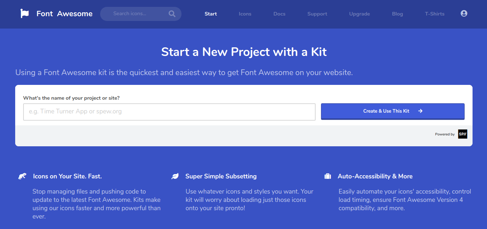
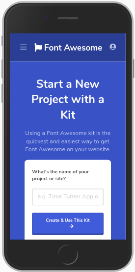

# <a href="https://jseguraweb.github.io/font-awesome-website-clone/">font-awesome-website-clone</a>

> CSS Project: create a clone of the Font Awesome Website

> ## Details:

- It's about practicing. The intended user and the client is going to be me. 
- Goal: include it in my portfolio.
- Content required: 
    
    - Font awesome icons

> ## Priorities:

1. Start a Repository on GitHub
2. Follow the original website wireframe
3. Research. Topic: how to deal with font awesome icons
4. Coding time

    **GOAL: create a responsive CSS website imitating the landing page of the font-awesome's one**

    

> ## New skills (to research):

- font awsome icons

> ## Achievements + lessons learned:

- get comfortable positioning elements, displays flex and grid
